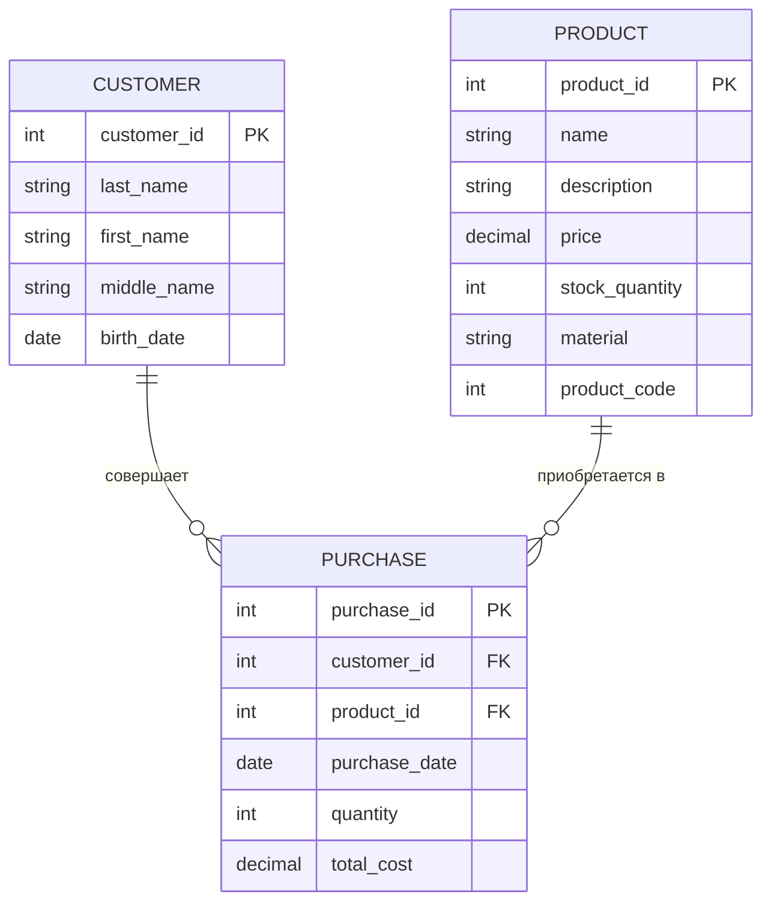

## ER-диаграмма ювелирного магазина

## Описание таблиц

**1. **CUSTOMER (Клиент)**:
   - customer_id: уникальный идентификатор клиента (первичный ключ)
   - last_name, first_name, middle_name: ФИО клиента
   - birth_date: дата рождения клиента

2. **PRODUCT (Товар)**:
   - product_id: первичный ключ
   - name: название товара
   - description: описание товара
   - price: цена товара
   - stock_quantity: количество товара на складе
   - material: материал изделия
   - product_code: уникальный номер товара (6 символов)

3. **PURCHASE (Покупка)**:
   - purchase_id: уникальный идентификатор покупки (первичный ключ)
   - customer_id: внешний ключ, связывающий с таблицей CUSTOMER
   - product_id: внешний ключ, связывающий с таблицей PRODUCT
   - purchase_date: дата покупки
   - quantity: количество приобретенного товара
   - total_cost: общая стоимость покупки

## Выбранная таблица для дальнейшей работы:
**Таблица PRODUCT - Товар**
<mxGraphModel><root><mxCell id="0"/><mxCell id="1" parent="0"/><mxCell id="2" value="+ __init__(product_id: Optional[int], name: str, description: str,&amp;nbsp;&lt;br&gt;price: Decimal, stock_quantity: int, material: str, product_code: str)&amp;nbsp;&lt;br&gt;+ description: str (getter &amp;amp; setter)&amp;nbsp;&lt;br&gt;+ stock_quantity: int (getter &amp;amp; setter)&amp;nbsp;&lt;br&gt;+ material: str (getter &amp;amp; setter)&amp;nbsp;&lt;br&gt;+ create_new_product(product_id: Optional[int], name: str,&amp;nbsp;&lt;br&gt;description: str, price: Decimal,&amp;nbsp;&lt;br&gt;stock_quantity: int, material: str, product_code: str) -&amp;gt; Product&lt;br&gt;+ create_from_string(product_string: str) -&amp;gt; Product&amp;nbsp;&lt;br&gt;+ create_from_json(json_string: str) -&amp;gt; Product&amp;nbsp;&lt;br&gt;+ to_json(): str&amp;nbsp;&lt;br&gt;+ __str__(): str&amp;nbsp;" style="rounded=0;whiteSpace=wrap;html=1;align=left;fillColor=#fff2cc;strokeColor=#d6b656;" vertex="1" parent="1"><mxGeometry x="280" y="510" width="340" height="210" as="geometry"/></mxCell></root></mxGraphModel>

