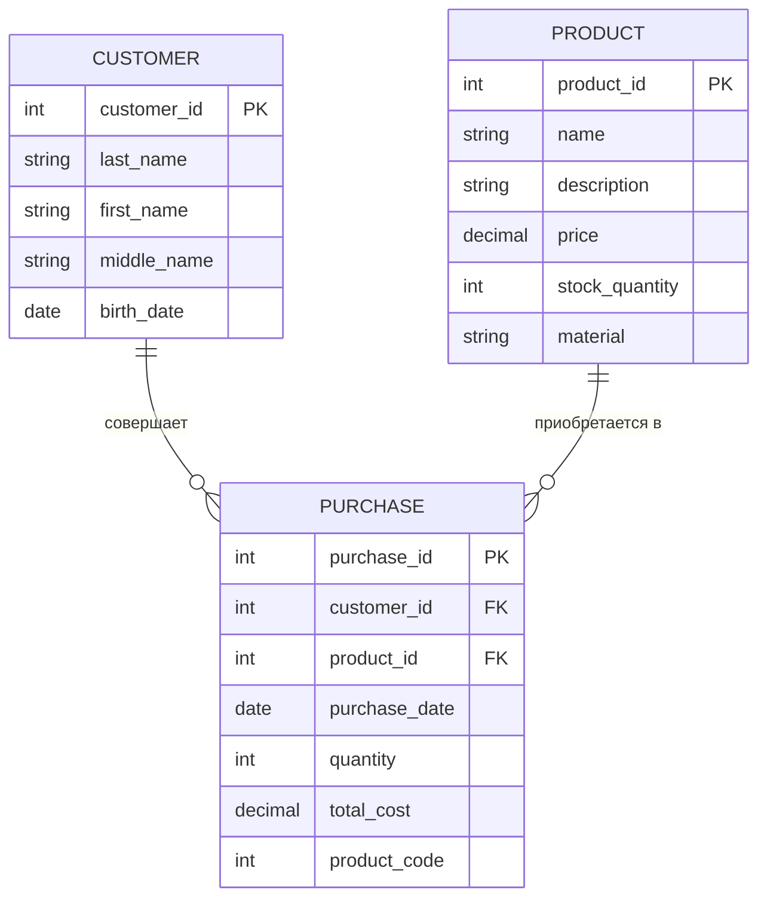
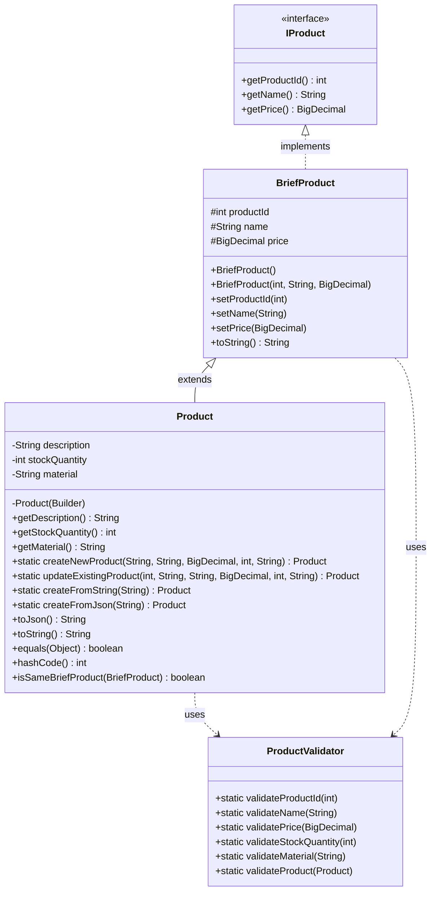

## ER-диаграмма ювелирного магазина

## Описание таблиц

1. **CUSTOMER (Клиент)**:
   - customer_id: уникальный идентификатор клиента (первичный ключ)
   - last_name, first_name, middle_name: ФИО клиента
   - birth_date: дата рождения клиента

2. **PRODUCT (Товар)**:
   - product_id: первичный ключ
   - name: название товара
   - description: описание товара
   - price: цена товара
   - stock_quantity: количество товара на складе
   - material: материал изделия
   - product_code: уникальный номер товара (6 символов)

3. **PURCHASE (Покупка)**:
   - purchase_id: уникальный идентификатор покупки (первичный ключ)
   - customer_id: внешний ключ, связывающий с таблицей CUSTOMER
   - product_id: внешний ключ, связывающий с таблицей PRODUCT
   - purchase_date: дата покупки
   - quantity: количество приобретенного товара
   - total_cost: общая стоимость покупки

## Выбранная таблица для дальнейшей работы:
**Таблица PRODUCT - Товар**

## Диаграмма классов

